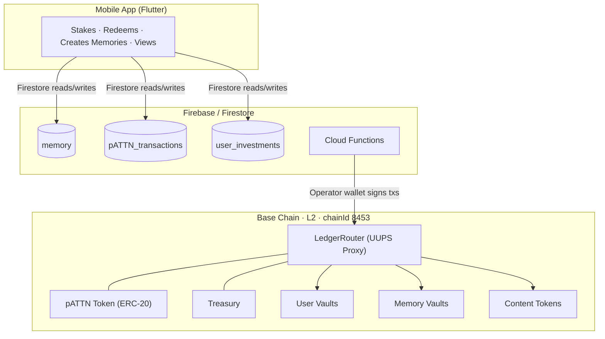
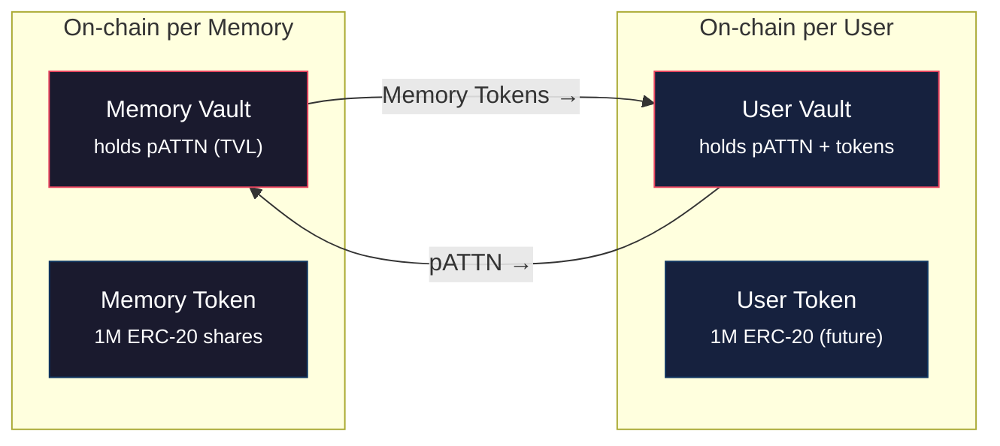
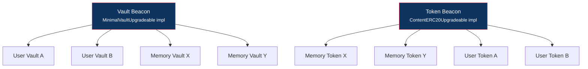
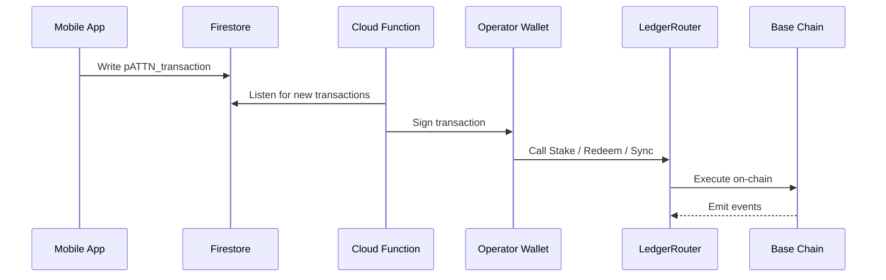
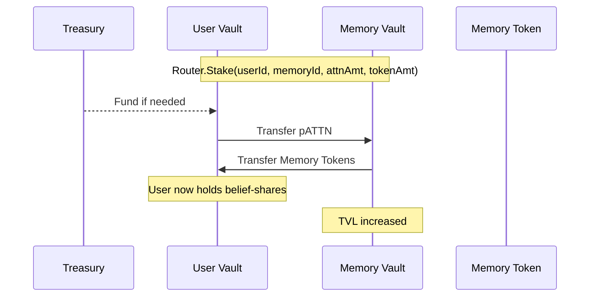
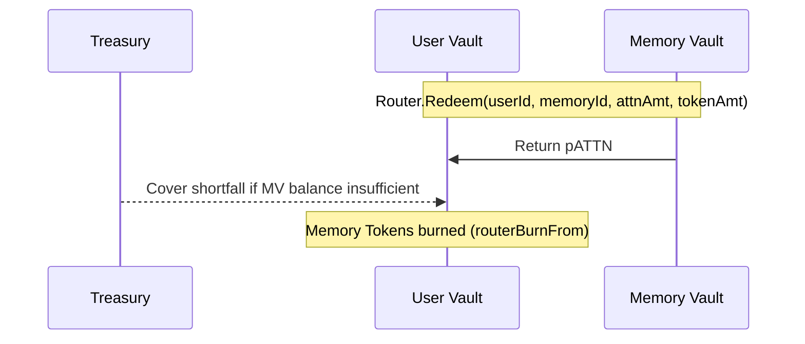
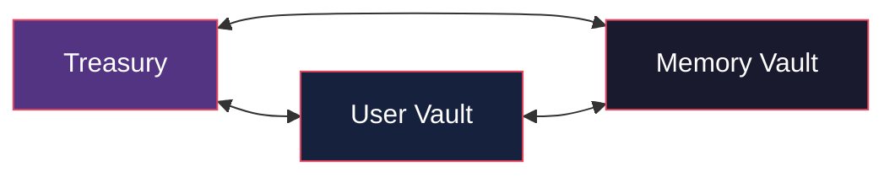
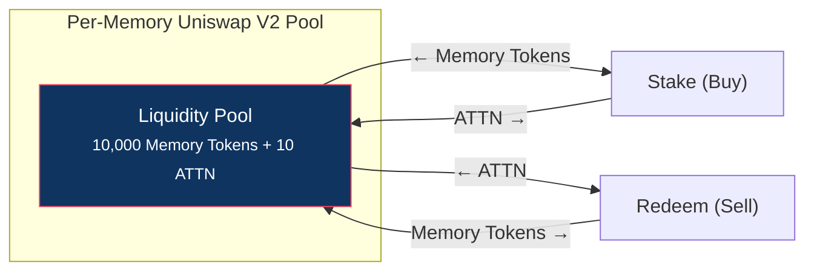
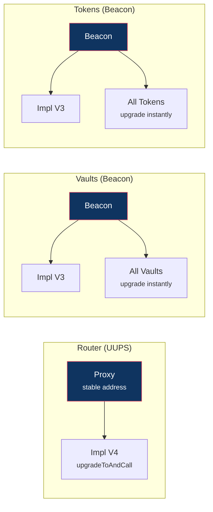
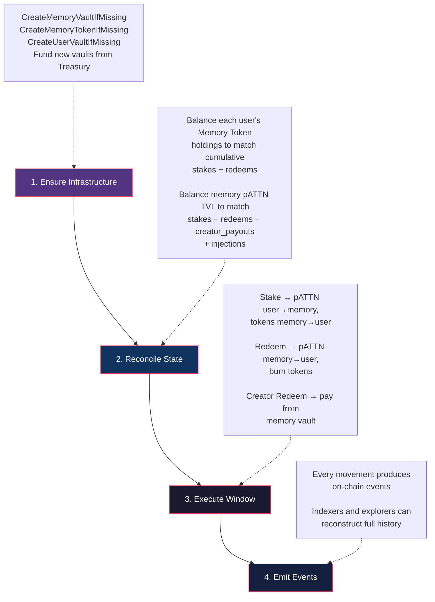

## How Collective Memory bridges Firebase with an immutable on-chain ledger on Base

\
Collective Memory (CM) is a social content platform where users create **memories** (photos, videos, text) and other users express belief in those memories by **staking** the platform's native token. The system bridges a traditional Firebase/Firestore web2 backend with an immutable on-chain ledger on **Base** (Ethereum L2), creating a dual-layer architecture: fast UX in web2, verifiable truth on-chain.

## System Overview



---

## Primitives

The entire system is built on three primitives — each with a web2 representation (Firestore document) and a web3 representation (on-chain contracts).

### pATTN — Proto Attention Token

The unit of value in the system. A standard ERC-20 token deployed on Base.

<Info>
  The entire 1B supply is pre-minted to the deployer and transferred to the **Treasury** wallet. From there, the LedgerRouter moves pATTN in and out of user/memory vaults as directed by the backend.
</Info>

| Property | Value |
| --- | --- |
| Name | Proto Attention Token |
| Symbol | `pATTN` |
| Decimals | 6 |
| Max Supply | 1,000,000,000 (1 billion) |
| Contract | `PATTNToken.sol` |
| Base Mainnet | [`0xd6fB...2939bc`](https://basescan.org/address/0xd6fB4C152CdD6a5c52eBd2eB5159D7F54c2939bc) |

A future mainnet token **ATTN** (`ATTNToken.sol`) shares the same structure but has a separate deployment path.

### User

A user in web2 is a Firebase Auth UID (e.g. `ZY7pZu4txwcXw7nnOE0rmBU14g83`). On-chain, each user is identified by `bytes32(keccak256(userId))`.

Each user gets **two on-chain entities**, deployed lazily on first interaction:

| Entity | Contract | Purpose |
| --- | --- | --- |
| **User Vault** | `MinimalVaultUpgradeable` | Holds the user's pATTN balance and any Content Tokens received from staking |
| **User Token** | `ContentERC20Upgradeable` | Per-user ERC-20 (1M supply, 6 decimals) — reserved for future social-graph tokenization |

### Memory

A memory is user-generated content (image, video, text) stored in Firestore under the `memory` collection. On-chain: `bytes32(keccak256(memoryId))`.

Each memory gets **two on-chain entities**, also deployed lazily:

| Entity | Contract | Purpose |
| --- | --- | --- |
| **Memory Vault** | `MinimalVaultUpgradeable` | Holds the pATTN staked into this memory (the memory's TVL) |
| **Memory Token** | `ContentERC20Upgradeable` | Unique ERC-20 representing belief-shares in this memory. 1M supply, 6 decimals. Minted once, distributed to stakers proportionally |



---

## The LedgerRouter — Central Orchestrator

> **Contract**: `LedgerRouterUUPS.sol` (UUPS-upgradeable proxy) **Base Mainnet**: [`0x8B38...6f02`](https://basescan.org/address/0x8B3811D3E50d26E0D493e159b9F1F70A1a5a6f02)

The Router is the single entry point for all on-chain operations. It owns every vault and token (as their OpenZeppelin `Ownable` owner), meaning **only the Router can move funds**. External callers must be the Router's owner (admin) or an approved operator.

### Deterministic Addressing (CREATE2)

All vaults and tokens are deployed via `CREATE2` with deterministic salts, making addresses predictable before deployment:

```solidity
User Vault    → keccak256("USER",          keccak256(userId))
Memory Vault  → keccak256("CONTENT_VAULT", keccak256(memoryId))
Memory Token  → keccak256("CONTENT_TOKEN", keccak256(memoryId))
User Token    → keccak256("USER_TOKEN",    keccak256(userId))
```

The `compute*Address()` view functions return addresses at zero gas cost. The `Create*IfMissing()` functions are idempotent — calling them for an already-deployed entity is a no-op.

### Beacon Proxy Pattern

Vaults and tokens are `BeaconProxy` instances pointing to shared implementation beacons. Upgrading a beacon implementation upgrades **all** proxies simultaneously.



### Operator Model

The Router uses an allowlist of **operator wallets**. Backend Cloud Functions hold operator private keys and sign transactions — this is the bridge between web2 and web3.



---

## Core Operations

### Stake (User → Memory)

When a user stakes pATTN into a memory, pATTN flows from the user to the memory, and Memory Tokens flow back.



### Redeem Staker (User ← Memory)

When a user redeems, pATTN returns and Memory Tokens are burned.



The returned pATTN may be more or less than the original stake, depending on how the memory's TVL has grown through other stakes and injections.

### Creator Redeem (Memory → Creator)

Memory creators earn revenue when others stake. `CreatorRedeem` pays out from the Memory Vault with the Treasury as backstop:

```solidity
Router.CreatorRedeem(memoryId, creatorUserId, amount, memo)
// pATTN: Memory Vault → Creator's User Vault (remainder from Treasury)
```

### Injections & Rewards

| Operation | Router Function | Flow | Effect |
| --- | --- | --- | --- |
| **Memory Injection** | `Sync` | Treasury → Memory Vault | Boosts TVL without minting tokens (rewards existing stakers) |
| **User Reward** | `Sync` | Treasury → User Vault | Grants pATTN directly (awards, bonuses) |
| **User Penalty** | `Sync` | User Vault → Treasury | Claws back pATTN |

### Sync — Universal Reconciliation

`Sync` is the most important low-level operation. It moves either **pATTN** or **Memory Tokens** between three locations:



Every movement emits a canonical `Synced` event for full auditability. The higher-level `Sync(id, scope, target)` variant computes the delta automatically and calls the generic mover.

---

## How Value Is Created

### Original Design: Uniswap AMM Pairs

The original architecture used **Uniswap V2** to create an automated market for each memory:



- **Staking** = buying Memory Tokens with ATTN through the pool (price goes up)
- **Redeeming** = selling Memory Tokens back for ATTN (price goes down)
- **Linking memories** = the `cmLiquidity` contract splits ATTN, buys tokens of two memories, and adds cross-liquidity — creating a **value bridge** between memories

Each memory had a real-time market price driven by supply and demand via the constant product formula `x * y = k`.

### Current Design: Managed Ledger Router

The production system replaced Uniswap pools with a **managed ledger** for several reasons:

<CardGroup cols={2}>
  <Card title="Gas Efficient" icon="gas-pump">
    No AMM swap fees or slippage per transaction
  </Card>

  <Card title="Predictable Pricing" icon="chart-line">
    Token-to-pATTN ratios controlled by the backend
  </Card>

  <Card title="Batch Settlement" icon="layer-group">
    Full pipeline runs off-chain, settles on-chain in batches
  </Card>

  <Card title="Gasless UX" icon="user-shield">
    Users never need ETH or wallet interactions
  </Card>
</CardGroup>

Each memory still gets a unique ERC-20 (1M supply, 6 decimals), and the bonding math (how many tokens per pATTN staked) is computed off-chain by the Firebase backend using the same AMM curve principles. The on-chain Router then executes the pre-calculated movements.

<Tip>
  **The AMM math still governs pricing** — it just runs in the Firebase layer rather than in a Uniswap pool. The on-chain contracts serve as the immutable settlement and custody layer.
</Tip>

---

## On-Chain Contracts

### MinimalVault — Custody

Each vault is a simple token-holding contract with two operations:

| Function | Direction | Description |
| --- | --- | --- |
| `pull(token, from, amount, memo)` | Inbound | Transfers tokens into the vault (requires prior approval) |
| `push(token, to, amount, memo)` | Outbound | Transfers tokens out of the vault |

Every movement emits a `LedgerMove` event with a sequential nonce, token address, direction, counterparty, amount, and memo string — creating a complete, auditable on-chain history.

<Warning>
  Only the Router (as `owner`) can call `pull` and `push`. No user or external contract can directly move funds from a vault.
</Warning>

### ContentERC20 — Memory Token

A minimal ERC-20 with two special capabilities:

| Function | Description |
| --- | --- |
| `mintOnce(to, amount)` | Can only be called once (when `totalSupply == 0`). Mints the full supply into the Memory Vault |
| `routerBurnFrom(from, amount)` | Allows the Router to burn tokens from any vault it controls (used during staker redemptions) |

Fixed at 6 decimals. Fully standard ERC-20 otherwise (transferable, queryable).

### Content Provenance

The Router records provenance metadata linking on-chain entities to off-chain content storage:

```solidity
event MemoryContentRecorded(memoryId, memoryToken, memoryIdStr, blobId, provider)
event MemoryInterfaceRecorded(memoryId, memoryToken, memoryIdStr, url, provider)
```

This creates a verifiable chain: **token → blobId/URL → content** (e.g., a Walrus blob or IPFS hash).

---

## Deployment Topology

### Base Mainnet (chainId 8453)

| Component | Address |
| --- | --- |
| **pATTN Token** | [`0xd6fB4C152CdD6a5c52eBd2eB5159D7F54c2939bc`](https://basescan.org/address/0xd6fB4C152CdD6a5c52eBd2eB5159D7F54c2939bc) |
| **LedgerRouter Proxy** | [`0x8B3811D3E50d26E0D493e159b9F1F70A1a5a6f02`](https://basescan.org/address/0x8B3811D3E50d26E0D493e159b9F1F70A1a5a6f02) |
| **Vault Beacon** | [`0x37ee24dc4F643E01c646939085dB74796aB79B61`](https://basescan.org/address/0x37ee24dc4F643E01c646939085dB74796aB79B61) |
| **Token Beacon** | [`0x9F03C1182cb598F81bFdB12f7EFd8288673A6930`](https://basescan.org/address/0x9F03C1182cb598F81bFdB12f7EFd8288673A6930) |
| **Treasury** | [`0xba9Ac7D65f5497b25322Cd7E336f6dA2Bf832A92`](https://basescan.org/address/0xba9Ac7D65f5497b25322Cd7E336f6dA2Bf832A92) |
| **Admin** | [`0x25fF289bF5517ceCd001b614032ec6D880Ee755F`](https://basescan.org/address/0x25fF289bF5517ceCd001b614032ec6D880Ee755F) |

### Upgrade Path



Each version uses `reinitializer(N)` for safe post-upgrade initialization of new storage slots, and `__gap` arrays to reserve future storage space.

---

## The Pipeline — Web2 to Web3 Flow

The reconciliation pipeline ensures on-chain state stays consistent with the web2 ledger, even if transactions arrive out of order.



This **"balance-to-moment, then execute"** pattern ensures the on-chain state is always consistent with the web2 ledger.

---